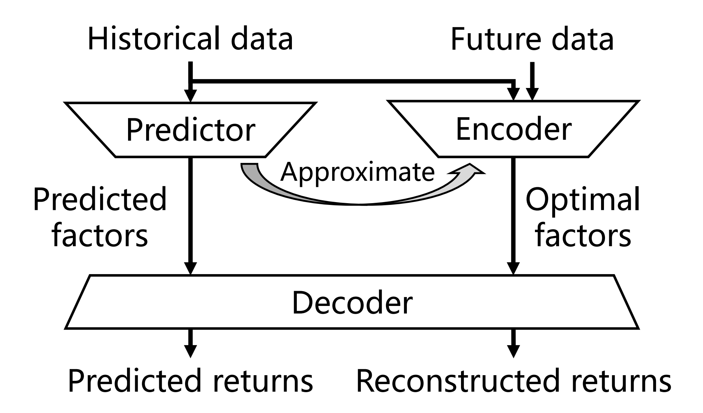
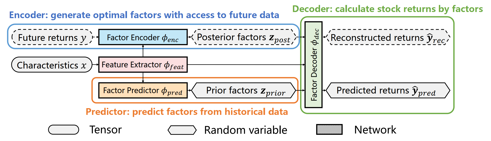
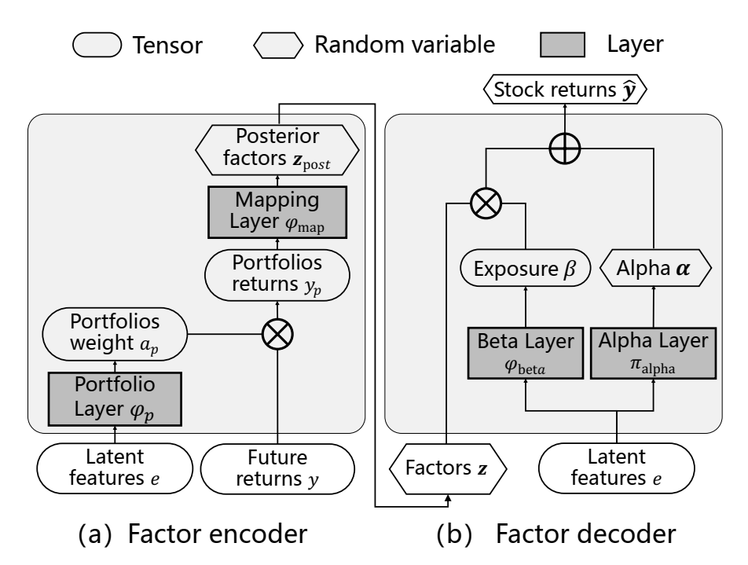
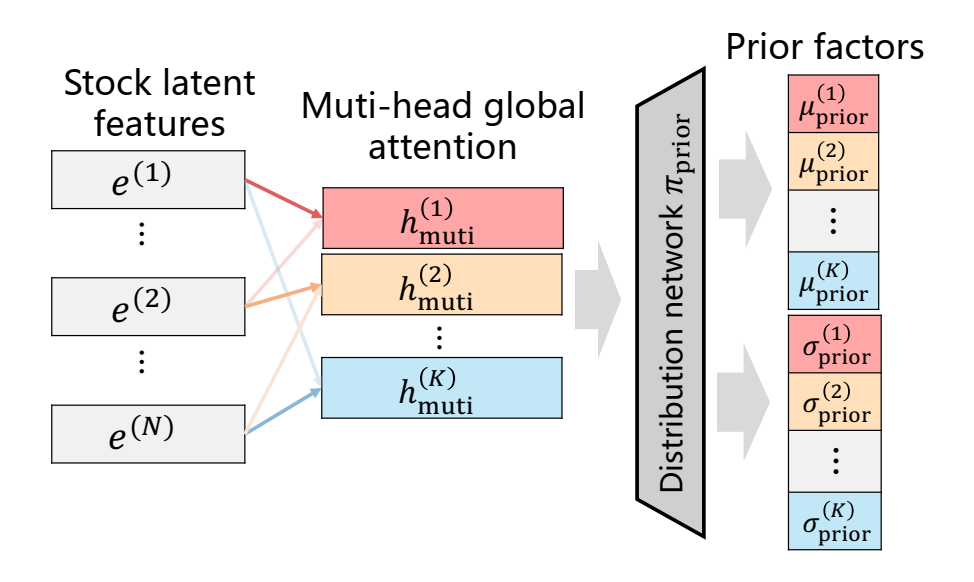

# facvae
A PyTorch inplementation of FactorVAE refering to ["FactorVAE: A Probabilistic Dynamic Factor Model Based on Variational Autoencoder for Predicting Cross-Sectional Stock Returns"](https://ojs.aaai.org/index.php/AAAI/article/view/20369)


## 1. Introduction
### 1.1. Abstract
As an asset pricing model in economics and finance, factor model has been widely used in quantitative investment. Towards building more effective factor models, recent years have witnessed the paradigm shift from linear models to more flexible nonlinear data-driven machine learning models. However, due to low signal-to-noise ratio of the financial data, it is quite challenging to learn effective factor models. In this paper, we propose a novel factor model, FactorVAE, as a probabilistic model with inherent randomness for noise modeling. Essentially, our model integrates the dynamic factor model (DFM) with the variational autoencoder (VAE) in machine learning, and we propose a prior-posterior learning method based on VAE, which can effectively guide the learning of model by approximating an optimal posterior factor model with future information. Particularly, considering that risk modeling is important for the noisy stock data, FactorVAE can estimate the variances from the distribution over the latent space of VAE, in addition to predicting returns. The experiments on the real stock market data demonstrate the effectiveness of FactorVAE, which outperforms various baseline methods.

### 1.2. Visualization
**1.2.1. Brief illustration**
<div align=center>
    
</div>

**1.2.1. Overall framework**
<div align=center>
    
</div>

**1.2.2. Encoder-decoder architecture**
<div align=center>
    
</div>

**1.2.3. Factor predictor with multi-head global attention mechanism**
<div align=center>
    
</div>


## 2. Notation
### 2.1. Scalar (constant)
- E: size of epochs (arbitrary)
- B: size of batches (arbitrary)
- N: size of stocks (arbitrary)
- T: size of time periods (arbitrary)
- C: size of characteristics
- H: size of hidden features
- M: size of portfolios
- K: size of factors
### 2.2. Tensor (variable)
- `x`: characteristics, B\*N\*T\*C
- `y`: stock returns, B\*N
- `e`: hidden features, B\*N\*H
- `y_p`: portfolio returns, B\*M
- `z_post`: posterior latent factor returns, B\*K 
- `z_prior`: prior latent factor returns, B\*K 
- `alpha`: idiosyncratic returns, B\*N
- `beta`: factor exposures, B\*N\*K
- `y_hat`: reconstructed stock returns, B\*N
- `mu_post`: mean vector of `z_post`, B\*K
- `sigma_post`: std vector of `z_post`, B\*K
- `mu_prior`: mean vector of `z_prior`, B\*K
- `sigma_prior`: std vector of `z_prior`, B\*K
- `mu_alpha`: mean vector of `alpha`, B\*N
- `sigma_alpha`: std vector of `alpha`, B\*N
- `mu_y`: mean vector of `y_hat`, B\*N
- `Sigma_y`: cov matrix of `y_hat`, B\*N\*N


## 3. Module
### 3.1. \_\_init\_\_.py
`FactorVAE` (*top-level encapsulated class*) extracts effective factors from noisy market data. First, it obtain optimal factors by an encoder-decoder architecture with access to future data, and then train a factor predictor according a prior-posterior learning method, which extracts factors to approximate the optimal factors.

### 3.2. data.py
`get_dataloaders()` (*top-level encapsulated function*) gets training, validation, and testing dataloader.
`RollingDataset` yields characteristics `x` in R^{N*T*C}, and future stock returns `y` in R^{N} in each iteration.
`train_valid_test_split()` splits the full dataset into training, validation, and testing dataset.
`change_freq()` changes the frequency of the panel data.
`shift_ret()` shifts returns to the previous period then drop NaN.

### 3.3. pipeline.py
`train_model()`, `validate_model()`, and `test_model()` (*top-level encapsulated functions*) are three stages of the pipeline of using `FactorVAE`.
`loss_func()` gets the loss value of the model.
`gaussian_kld()`: calculate KL divergence of two multivariate independent Gaussian distributions.

### 3.4. feature_extractor.py
`FeatureExtractor` extracts stocks hidden features `e` from the historical sequential characteristics `x`.

### 3.5. factor_encoder.py
`FactorEncoder` extracts posterior factors `z_post`, a random vector following the independent Gaussian distribution, which can be described by the mean `mu_post` and the standard deviation `sigma_post`, from hidden features `e` and stock returns `y`.
`PortfolioLayer` dynamically re-weights the portfolios on the basis of stock hidden features `e`.
`MappingLayer` maps `y_p` as the portfolio returns to the distribution of posterior factor returns `z_post`.

### 3.6. factor_decoder.py
`FactorDecoder` calculates predicted stock returns `y_hat`, a random vector following the Gaussian distribution, which can be described by the mean `mu_y` and the covariance matrix `Sigma_y`, from distribution parameters of factor returns `z` (could be `z_post` or `z_prior`) and hidden features `e`.
`AlphaLayer` outputs idiosyncratic returns `alpha` from the hidden features `e`.
`BetaLayer` calculates factor exposures `beta` from hidden feautres `e`.

### 3.7. factor_predictor.py
`FactorPredictor` extracts prior factor returns `z_prior`, a random vector following the independent Gaussian distribution, which can be described by the mean `mu_prior` and the standard deviation `sigma_prior`, from hidden features `e`.
`MultiheadGlobalAttention` implements a specific type of multi-head global attention.


## 4. Example
*To be continued*
```Python
import pandas as pd
from facvae import FactorVAE
from facvae.data import get_dataloaders
from facvae.pipeline import train_model, valide_model, test_model


if __name__ == "__main__":
    # constants
    E = 25
    B = 16
    N = 74
    T = 20
    C = 28
    H = 10
    M = 32
    K = 8
    h_prior_size = 16
    h_alpha_size = 16
    h_prior_size = 16
    partition = [0.7, 0.2, 0.1]
    lr = 0.0001

    # model
    fv = FactorVAE(C, H, M, K, h_prior_size, h_alpha_size, h_prior_size)

    # data
    df = pd.read_pickle("df.pickle")
    dl_train, dl_valid, dl_test = get_dataloaders(df, T, B, partition)

    # train
    train_model(fv, dl_train, lr, E, 1.0)

    # test
    loss = test_model(fv, dl_test)

    # predict
    x, y = next(iter(dl_test))
    mu_y, Sigma_y = fv.predict(x)
    
    print(Sigma_y)
    print(mu_y)
    print(y)
    print(((mu_y - y) ** 2).mean())
```
